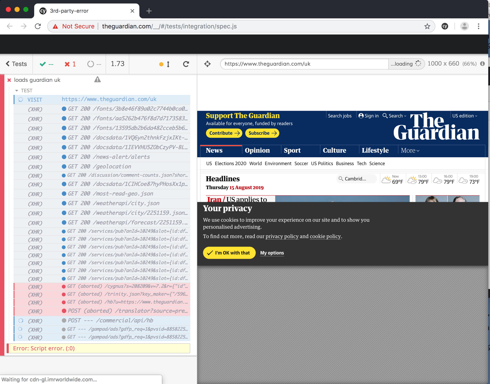
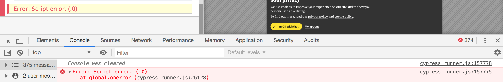

# 3rd party JavaScript error

Illustrates how Cypress test runner cannot see 3rd party domain errors, see [cypress-io/cypress/issues/4717](https://github.com/cypress-io/cypress/issues/4717)

## Install and run

```shell
npm install
npm run cy:open
```

Example test in [cypress/integration/spec.js](cypress/integration/spec.js) tries to load `https://www.theguardian.com/uk`. While loading there is a JavaScript error thrown in a script loaded from some 3rd party domain, not from `theguardian.com` but from some other bundle it loads from elsewhere.



Notice that the error shown by Cypress is simply `Error:0` since Cypress has no access to 3rd party JavaScript coming from domains other than `theguardian.com`

Even if you click on the error itself, the DevTools console does not show the stack


